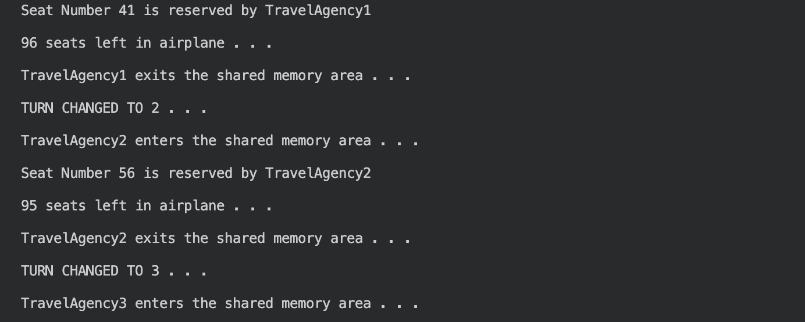
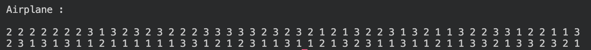
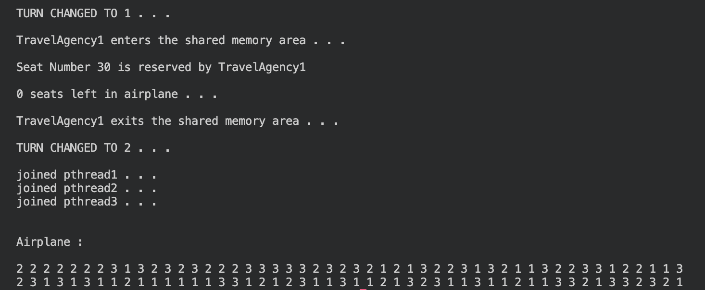

# **Airline Reservation System**

Simulation of an Airline Reservation System with three travel agencies trying to occupy seats for their customers on the same aeroplane.

- Multithreading implementation using POSIX threads and practice of handling shared memory allocation.

  

- Aeroplane Seats are represented as a matrix.
  

- Each travel agency is enumerated with a value representing their turn, during the turn travel agency randomize a column and row number, if the seat is available then occupies it.

  

## Installation and Run:

```
 $ g++ AirlineReservation.cpp -o main
 $ ./main.out
```
